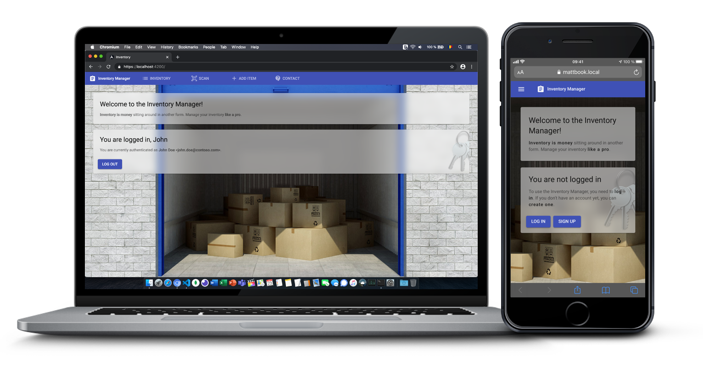

# Inventory Manager

## Synopsis

The frontend of this desktop and mobile-friendly inventory manager was developed using [Angular CLI](https://github.com/angular/angular-cli) version 10.1.2, with the help of the following `npm` packages: [`@angular/material`](https://www.npmjs.com/package/@angular/material), [`@angular/router`](https://www.npmjs.com/package/@angular/router), [`@ecodev/fab-speed-dial`](https://www.npmjs.com/package/@ecodev/fab-speed-dial), [`@zxing/ngx-scanner`](https://www.npmjs.com/package/@zxing/ngx-scanner), [`angularx-qrcode`](https://www.npmjs.com/package/angularx-qrcode), [`moment`](https://www.npmjs.com/package/moment), [`ngx-print`](https://www.npmjs.com/package/ngx-print) and more. The web app features an inventory editor, a QR code scanner & printer, and authentication via JWT.

## Running the web app

Run `npm start` for a dev server. Navigate to `https://localhost:4200/`. The app will automatically reload if you change any of the source files.

Alternatively, execute `npm run start-network` to expose the application to the local network. Note that running this server is a security risk, therefore it should be run for testing purposes only.